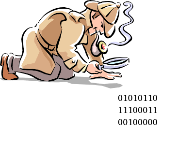

_Programming Assignment 5 (PA05)_

# TreeMap (Binary Search Tree) Implementation

--- 

## Assignment Description:

There is a serial diamond thief on the loose in the sleepy town of Moriah, NY and you’re on the case!

This crazy criminal loves to taunt law enforcement by leaving behind a clue about his next target at the scene of each crime (in the form of a large text file with UTF-8 encoding and UNIX-style line-endings, the clever devil). Your fellow detectives have determined that the perp is using some kind of cypher in the notes that he leaves, and they need your help analyzing the contents to break the code!

Some cyphers can be cracked by looking at the frequency at which cypher-letters appear, and matching them to the average frequency of letters as they appear in the English language. You’ll need to build a data structure that can efficiently map each character to how many times it appears in the clue-file.

In this assignment, your task will be to replicate the behavior of the std::map data structure using a [[TreeMap]]. You’ll then create a function for analyzing the frequency of characters to help catch the thief.

## Scoring:

To get full points on the assignment...
* Implement each function in the _MyMap_ class **(unit_tests)**
* Implement _get_char_frequency_ using your map **(stdio_tests)**
* Fix any memory leaks or invalid memory operations **(mem_tests)**
* Address any warnings given by cppcheck **(static analysis)**
* Format your code using the clang-format utility **(style check)**

# General information regarding this repository

## Coding
Tips for coding.

### What to name my files?
We give you empty files corresponding to those you should complete!

### Where to code?
We assume you're on a Linux machine, and can install all the software needed by this auto-grader.
See the syllabus for more details.

### How to get this code?
Find the blue button that says "clone", on the home page of this repository.
If you have an ssh key set up:
 `git clone git@... `
If you don't have an ssh set up, or know what that is:
 `git clone https://.. `

### Where to read this file?
This file is nicely displayed in the Gitlab web interface, but you can read it wherever.

### What to install?
See the script's warnings.

### How to code?
Using this script, we strongly encourage you to program incrementally. 
Program code required by the unit tests, in the requested order. 
In general, don't proceed to a later function if you are not passing the first one.
If you get stuck, instead of moving on, get help!
See the syllabus for extended coding tips.

## Auto-grader

### How to run the auto-grader on your machine?
Run the following in the root directory of your repository:
 `./grade.sh `

## How to run the auto-grader on Gitlab-CI?
Make sure all your files are added, committed, and pushed to the appropriate branch (see Git section below).
Navigate to the Gitlab web interface to confirm these changes exist on the server.

## How to make sure I'm getting points?
 * Click on CI/CD -> Jobs -> the latest job.
 * Is it passing, green, etc? 
 * What grade does it say you have?
 * Whatever grade the latest job says, is what we think you have!

## std-io tests: differences between your std-out and the desired std-out
See:  `your _diffs/ ` and  `your _outputs ` to determine what went wrong. 
We run these diffs automatically, so you may not need to manually inspect these files.

## Unit tests: we're micromanaging your functions!
See the unit tests themselves, and run them in your favorite debugger:
 `unit _tests/ `

## Git
Git happens...

### add, commit, push
From within your git repository (folder), add, commit, and push all the non-generated files. 
This means add your cpp and png files, but not a.out, etc.
Verify you can see the files on git-classes in the web interface.
If you can see the correct files on git-classes in your master branch, your submission is complete.
Make sure all the requested files are in the root directory of the repository unless otherwise specified.

## Errors
You should not change any of the grading files themselves. 
If you do, you will see a warning, and it will give you a 0.
If you accidentally did that:
`git checkout firstfourcharactersoflastcommitbyus graderfileyoubroke`

### Is the auto-grader broken?
Is the error you're encountering our fault or yours?
Either may be possible, while the latter is a bit more likely.
Double-check all the diffs, and step through all code to see.
If you think you found a bug, please let us know!

## When is this due?
See the syllabus!

## grade.sh: this automated grading framework
For more details on the generalized auto-grader, see:
https://gitlab.com/classroomcode/grade-sh/grade-sh

